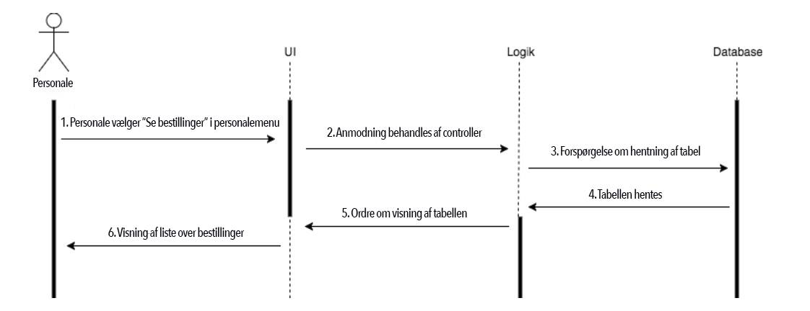
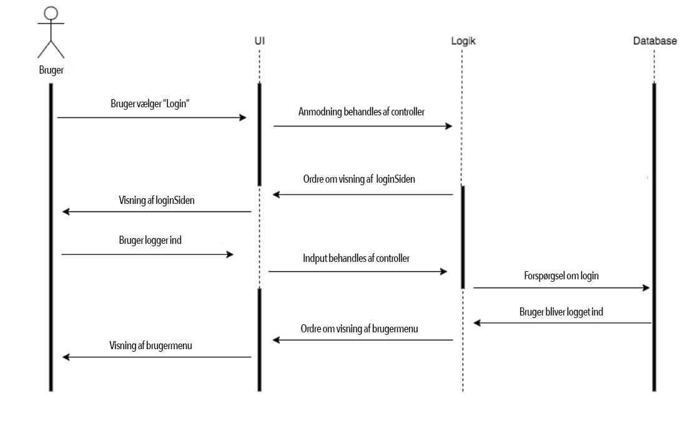
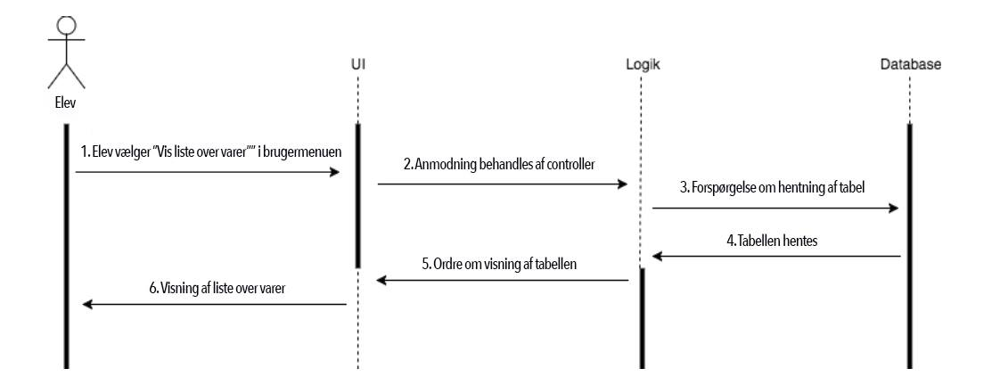

# Team-YOLO - Kantine App

## Kravspesifikation

### Server

S1 : Server skal kunne validere login baseret på et hashet password 

S2 : Server skal kunne adskille elev og kantinemedarbejde ved login   

S3 : Serveren skal kunne oprette en bruger   

S4 : Serveren skal udstille et API, der kan trække på serverens funktionalitet. API’et skal dække følgende funktionaliteter:
- En elev skal kunne oprette sig som bruger 
- En elev/kantinepersonale skal kunne logge ind/ud
- En elev skal kunne tilgå liste med priser og vareinformation
- En bruger skal kunne købe en vare
- Kantinepersonalet skal kunne tilgå en liste med alle bestillinger

S5 : Serveren skal kunne logge alle transaktioner

### Klient

K1 : Klienten skal udstille et login/logud  

K2 : Klienten skal kunne oprette en elev

K3 : Klienten skal udstille et menu med varer samt pris    

K4 : Klienten skal kunne tilade en bruger at købe en vare

K5 : Klienten skal kunne tilgå vareinformation og priser (elev)

K6 : Klienten skal kunne tilgå liste over bestillinger (kantinepersonalet)

## ER-diagram

## Klassediagram

## Flowchart

## Sekvensdiagram

### Sekvensdiagram 01

### Sekvensdiagram 02

### Sekvensdiagram 03

## Use-case diagram

## Use-cases med beskrivelser

### Gjest:

#### Opprett bruker:
Er man elev ved CBS som ennå ikke har en bruker registrert på kantine-programmet, har man muligheten for å opprette en bruker. En bruker skal inneholde et brukernavn og et passord som gjesten selv skal inntaste. Av sikkerhetsmessige hensyn blir passordet hashet, så man ikke utenfra skal kunne finne andres passord. Hvis et tilsvarende brukernavn ikke eksisterer, så vil brukeren bli opprettet, og du kan nå logge inn med brukeren. 

### Bruger:

#### Use-case 01 - Logg inn 
Er man en elev ved CBS som har opprettet en bruker på kantine-programmet, har man mulighet til å logge inn. Eleven taster inn sitt brukernavn og passord, velger logg inn, og deretter blir brukernavn og passord verifisert. Her blir det også sjekket hvorvidt denne brukeren er registrert som en del av kantinepersonalet eller ikke. Dersom brukeren finnes i databasen så vil man bli logget inn og sendes videre til forsiden.

#### Use-case 02 - Se varer 
Når man er logget inn, kan man velge å se varene som kantinene ved CBS tilbyr. Her vil man få en meny opp med f.eks. ulike bagels, sandwicher, smoothies og juicer. Ved hver vare skal det stå en beskrivelse med innhold og prisen på produktet. Dette gir brukeren mulighet til å se hvilke produkter de kan bestille.

#### Use-case 03 - Tilføy varer til handlekurv
Når en elev ved CBS er logget inn og ser på oversikten over varer i kantinen, kan en elev velge "bestill vare".  Da vil denne varen legges til den gitte brukers sin innkjøpskurv, men ordren er ikke bekreftet før eleven godkjenner i sin handlekurv. 

#### Use-case 04 - Se min innkjøpskurv / Check ut 
Når man har lagt ønskede varer i sin innkjøpskurv og ønsker å bekrefte en bestilling, skal man velge innkjøpskurven for å sjekke ut. Velger man å se sin innkjøpskurv, får man opp en oversikt over varene man har valgt. Deretter kan man velge å bekrefte varene og ordren sendes så til CBS kantinen som tilbereder ordren. En ordre er forpliktende, så etter du har lagt inn bestillingen plikter du deg til å avhente din ordre i kantinen for så betale den. 

#### Use-case 05 - Se mine tidligere ordre 
Etter man har utført én eller flere ordrer fra kantine-programmet, kan man se sin historikk med hva du har kjøpt tidligere. Dette kan være hensiktsmessig da brukeren da kan få en påminnelse om hva de har vært fornøyd med tidligere. 

### Staff: 

#### Use-case 06 - Logg inn
Er man en ansatt ved CBS kantine, som har opprettet seg en bruker på kantine-programmet, har man mulighet til å logge inn. Den ansatte bes om å taste inn sitt brukernavn og passord, velger logg inn, og deretter blir brukernavn og passord verifisert. Her blir det også sjekket hvorvidt denne brukeren er registrert som en del av kantinepersonalet eller ikke. Dersom brukeren finnes i databasen og er registrert som en del av kantinepersonalet, vil man bli logget inn og sendes videre til forsiden.

#### Use-case 07 - Se liste over bestillinger 
Er man logget inn som kantinepersonell på CBS, kan man se en liste over alle bestillingene som har kommet inn. Denne er sortert i rekkefølge etter tidspunktet ordren ble bestilt. Her skal det stå brukernavnet til den som har bestilt, tidspunkt og vare/varer som kunden ønsker. 

#### Use-case 08 - Merk ordre som klar for avhenting
Er man innlogget som kantinepersonell på CBS, har man mulighet for å markere en ordre som klar for avhenting. Ved å se liste over bestillinger vil det være mulighet for å trykke på knappen som vil registrere ordren som klar for avhenting. 
